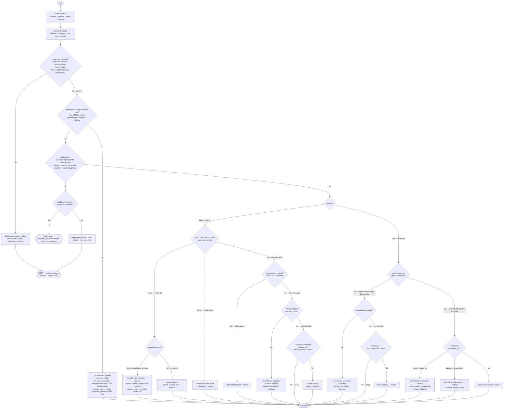

# Rollout strategy (v1)

Kako orkestrator vodi flotu od verzije N ka N+1. v1 namerno **nema** podešavanja
brzine (k8s `maxSurge`/`maxUnavailable` ne postoje u šemi) — ponašanje je
izvedeno iz `services.stateful` flaga.

## Dve strategije, biraju se po `stateful`

| `stateful` | strategija | surge | zašto |
|---|---|---|---|
| `false` | **rolling** | digni 1 novu pre nego ugasiš 1 staru (surge=1, unavailable=0) | replike su fungibilne; kratko smeš da vrtiš jednu viška, nula downtime-a |
| `true`  | **recreate** | 0 — drain stare → tek onda digni novu | volume single-writer lease: dve replike ne mogu držati isti lease (`AcquireVolumeLease → ErrConflict`), surge je nemoguć. Kratka nedostupnost je neizbežna |

`stateful` stiže u `SnapshotDesiredRow.Stateful`, pa orkestrator grana samo na
tom flagu. Nema per-deployment config-a u v1; ako zatreba (brži/sporiji rollout,
canary), dodaju se kolone na `deployments` kasnije.

## Kako orkestrator razlikuje novo od starog

`ListActiveReplicas` vraća replike za servis koji ima `is_current` deployment,
**uključujući** one pod superseded deployom (rollout u toku). Grupiši po
`(service_id, region)`, pa unutar grupe:

- `is_current = true`  → **novo** (target verzija, ka kojoj konvergiraš)
- `is_current = false` → **staro** (outgoing, za drain → reap)

Diskriminator je `is_current`, **ne** `replicas.revision` — to je CAS brojač za
Sensor↔Scheduler trku, nema veze sa verzijom deploya.

## `deployments.status` — životni ciklus deploya

Da, kad nov deploy preuzme primat, stari ide u `superseded`. Ceo enum:

| status | značenje |
|---|---|
| `pending` | upravo commit-ovan, orkestrator još nije počeo da diže replike |
| `active` | trenutni (`is_current`) deploy, sve target replike healthy — ustaljeno stanje |
| `draining` | rollout u toku: nove se dižu, stare ovog deploya se dreniraju |
| `failed` | nove replike crashloop-uju (`restart_count` > `restart_max`); rollout zamrznut |
| `rolledback` | ručno/automatski vraćeno na prethodnu verziju; `is_current` flipnut nazad |
| `superseded` | noviji deploy ga je zamenio; njegove preostale replike se gase |

`is_current` je ortogonalan flagu statusa: označava **jedan** aktivni commit po
servisu (parcijalni unique indeks `one_current_deployment_per_service`). Tipičan
prelaz na nov deploy: stari `active → superseded`, novi `pending → active`.

## Životni ciklus replike

```
pending → scheduling → starting → health_check → healthy → active
                                                               │
                                          IntentDrain ←────────┘ (nova verzija preuzima)
                                               │
                                           draining ──── drain_seconds istekne ──→ reaped
                                               │
                                         (ili crash)
                                               ↓
                                            failed
```

| faza | značenje |
|---|---|
| `pending` | kreirana, čeka placement |
| `scheduling` | bin-packing: traži se host |
| `starting` | kontejner se diže na hostu |
| `health_check` | kontejner up, čeka prvi healthy probe |
| `healthy` | prošao probe, nije još u rotaciji |
| `shifting` | migracija između hostova u toku |
| `active` | servira saobraćaj |
| `draining` | graceful shutdown: prima `SIGTERM`, čeka da završi in-flight zahteve |
| `reaped` | terminalno: kontejner ugašen, isključen iz snapshotova |
| `failed` | terminalno: `restart_count > restart_max` |

`reaped` i `failed` su terminalni — engine ih ne restartuje i `ListActiveReplicas`
ih ne vraća (`WHERE phase <> 'reaped'`). Kad sve stare replike deploja dođu u
`reaped`, taj deploy nema više aktivnih replika i rollout je završen.

## `drain_seconds` — prozor za graceful shutdown

Default: **30s** (`deployspec.DefaultDrainSeconds`). Kada orkestrator odluči da
ugasi staru repliku, emituje `IntentDrain` i beleži vreme (`drained_at`).
Tranzicija `draining → reaped` se dešava tek kad prođe `drain_seconds` od tog
trenutka:

```
t=0       orkestrator: replika.phase → draining, replika.drained_at = now()
t=N       Sensor prijavljuje kontejner SIGTERM / noticed gone
t=drain_seconds   Scheduler: replika.phase → reaped  (čak i ako kontejner
                  već odavno stao — čeka se pun prozor)
```

Zašto čekati pun prozor čak i kad kontejner stane ranije? Jer load-balancer
routing tabela može imati stale zapis; čekanje garantuje da novi zahtevi ne
stignu na već ugašenu repliku pre nego što se LB obnovi.

Ako je `drain_seconds = 0`: replika odmah prelazi u `reaped` bez čekanja —
korisno za stateless servise gde nema in-flight state-a i LB konvergira brzo.

## Šta orkestrator gleda svaki tick (gate-ovi)

- `healthy` / `phase` nove replike — ne napreduj dok poslednja podignuta nije `healthy`
- **Create i assign su jedna atomična akcija.** `IntentCreate` commituje `CreateReplica` + `AssignReplicaHost`
  u jednom `WithReconcileTx`: scheduler bin-pack-uje host u decide fazi (in-memory nad `snap.hosts` /
  `ListSchedulableHosts`), pa kreira red i rezerviše host **zajedno** pod CAS-om na `host.revision`. Replika se
  rađa već raspoređena — `host_id` nikad nije `NULL` na create putanji, a `pending → scheduling` se sažimaju u tren.
  Ako je host u međuvremenu zauzet → `ErrConflict`, ceo tx se vraća, ništa nije kreirano; ako nijedan host ne stane
  u decide fazi → create se prosto ne emituje ovog ticka.
- `host_id IS NULL` na novoj replici → replika je **izgubila host** (host pao/dreniran ili `shifting` migracija).
  To je jedini slučaj kad se NULL pojavi; rešava ga **re-placement** gate (`IntentAssign`): re-bind postojećeg
  reda na novi host, bez re-create-a. Stoji odmah posle crash gate-a da se izgubljeni kapacitet vrati pre health/count
  provera; ako nema mesta → `pokušaj ponovo sledeći tick`.
- `count new vs desired_count` → `below` = ramp up (`IntentCreate +1`); `above` = scale-down
  (`IntentDrain` viška **target** replika → `reaped`; recreate još i oslobađa `volume_lease`); `at` = pređi na drain outgoing
- `restart_count` vs `deployments.restart_max` → trip u `failed`, zamrzni rollout
- `progress_deadline` na health gate-u → nova replika koja se digne ali nikad ne postane `healthy`
  (a ne crash-uje da udari `restart_max`) bi inače zauvek blokirala rollout; kad health-gate stoji duže od
  `progress_deadline` → deployment `failed` (stalled), zamrzni za operatora
- `stateful` → recreate umesto rolling (vidi gore)
- `drain_seconds` → koliko se čeka od `drained_at` pre prelaza `draining → reaped`; default 30s; 0 = odmah

## `deployments.status = failed` — šta se desi

### Uzrok: replika udari restart_max

Svaka replika ima `restart_count` koji raste sa svakim crashom. Kad pređe
`deployments.restart_max` (default 5):

- Replika prelazi u `phase='failed'` — terminalno, engine je ne restartuje
- Ako je ta replika bila nova (rollout u toku) → deployment status → `failed`
- **Rollout se zamrzava**: stara verzija ostaje da servira, nova ne preuzima

### Šta znači "zamrznuto"

```
novi deploy:   is_current=true,  status=failed → nove replike failed/reaped, ne preuzimaju
stari deploy:  is_current=false, status=superseded → replike još žive i serviraju (drain gate nije prošao)
```

`is_current` se flipne na novi deploy već na `conductor up` (commit), **ne** kad nova
verzija postane healthy. Zato je tokom rollouta novi = `is_current=true` (target), a stari =
`is_current=false` (outgoing). Stare replike se cute drainaju tek kad nove prođu health gate;
u failed rollout-u taj gate nikad ne prođe, pa stari nastavlja da servira.

Orkestrator **ne radi automatski rollback**. `failed` je samo status kolona —
signal operatoru da nešto nije u redu. Jedino `conductor rollback` vraća `is_current`
na prethodnu verziju.

### Izlaz iz failed stanja

| akcija | šta se desi |
|---|---|
| `conductor rollback` | re-pointuje `is_current` na stariju verziju; failed → `rolledback`, target → `pending`; isti flow kao novi rollout |
| `conductor up` (nova slika/fix) | novi `deployments` row, prethodni failed → `superseded` |
| ručni restart replike | nije podržano u v1 — jedino novi deploy ili rollback |

### Redosled gate provjera po strategiji

**Rolling** (`stateful=false`):
1. Broj target replika u `healthy`/`active` vs `desired_count`:
   - `below` → kreiraj nove:
     - `outgoing` prazan (cold start / scale-up, nema staro da se čuva) → `IntentCreate × (desired − current)` **odjednom**
     - `outgoing > 0` (rolling update u toku) → `IntentCreate +1` (surge: digni novu pre stare)
   - `above` → `IntentDrain` viška target replika → `reaped` (scale-down), kraj ticka
   - `at` → nastavi
2. Sve outgoing već `reaped`? → `deployment.status = active`, gotovo (svež check svaki tick)
3. Inače, postoji outgoing u `active`? → `IntentDrain` (status → `draining`), kraj ticka
4. Inače (u `draining`), prošao `drain_seconds`? → `IntentDestroy` (→ `reaped`), kraj ticka — sledeći tick ponovo od koraka 2

**Recreate** (`stateful=true`):
1. Postoji outgoing replika koja nije `reaped`? → **ne diži novu**; ako je još u `active` → `IntentDrain` (status `draining`), inače ako je prošao `drain_seconds` → `IntentDestroy` (→ `reaped`). Svaki intent = kraj ticka.
2. Kad sve outgoing replike stignu u `reaped` (volume slobodan):
   - `below` → `IntentCreate × (desired − current)` odjednom (outgoing je već prazan, nema surge ograničenja)
   - `above` → `IntentDrain` viška target → `reaped` + oslobodi `volume_lease` (scale-down)
   - `at` → `deployment.status = active`
3. Čekaj novu do `healthy`

## Control flow — jedan reconcile tick

**Invarijanta: svaki intent završava tick.** Svako pravilo ili *hold*-uje (ne emituje ništa, kraj ticka)
ili emituje intent (kraj ticka); sledeći tick re-derivira iz svežeg snapshota. Zato „sve outgoing reaped?"
(`R_ALLDONE`) nije nastavak posle `IntentDestroy` nego **zaseban gate** na vrhu `at` grane — proverava se nad
**osmotrenim** stanjem sledećeg ticka, nikad nad projektovanim. Retire-mehanika (drain → prozor → reap, svaka
završava tick) je zato ista u obe strategije; razlikuje se samo redosled na vrhu: rolling *kreira-pa-povlači*,
recreate *povlači-pa-kreira*.



## Obim v1 — pokriveno vs van obima

Petlja iznad nije samo N→N+1 rollout; pokriva i steady-state i failure slučajeve:

- **Scale-down / scale-to-zero** — count gate je troputni (`below` / `at` / `above`); `above`
  drainuje višak **target** replika (recreate još i oslobađa `volume_lease`). Bez ovoga bi
  spuštanje `desired_replicas` zauvek kreiralo nove replike.
- **Reap je opšti, ne samo za outgoing** — i višak *target* replika iz scale-down-a (`R_SHRINK`) i *outgoing*
  replike iz rollouta (`R_INTENT_DRAIN`) završe u `draining` i reap-uju se **istom** tranzicijom: bilo koja replika sa
  `drained_at + drain_seconds < now` → `reaped`. Per-replika je i verzija-agnostičan — dijagram crta reap pod outgoing
  granom radi priče o rolloutu, ali scale-down-drained target repliku hvata identično pravilo
  (`{drainWindowElapsed, destroy}`). Bezuslovno bezbedno jer ulazak u `draining` je već prošao odgovarajući gate.
  *Status:* reaper živi u reconcile petlji — `reconcileIntentsFor` je još stub, dakle dizajnirano-ali-nije-povezano
  (komentari u `postgres.go` / `deployments.sql.go` već računaju na to da „reconcile petlja reap-uje replike").
- **Batch create kad nema outgoing-a** — surge=+1 throttle čuva *staru* verziju tokom rolling
  update-a; kad je `outgoing` prazan (cold start ili scale-up postojeće verzije) nema šta da se
  čuva, pa se kreira ceo deficit `(desired − current)` odjednom umesto +1/tick.
- **Progress deadline** — nova replika koja se digne ali nikad ne postane `healthy` (a ne crash-uje)
  bi zaglavila rollout; `progress_deadline` je trip u `failed (stalled)`, isti izlaz kao crashloop.
- **Create + assign su atomični** — `IntentCreate` rezerviše host u istom tx-u, pa se replika rađa već
  raspoređena (nema orphan reda). `host_id NULL` nastaje samo kad replika **izgubi** host (pad hosta / `shifting`),
  i tada ga vraća zaseban `IntentAssign` (re-placement). Per-tick vokabular: `create / assign / drain / destroy`.
- **`is_current` se flipne na `conductor up`** (commit), ne kad nova verzija postane healthy.

Namerno **van v1**: per-deployment knobovi brzine (canary, `maxSurge`/`maxUnavailable`),
ručni restart pojedinačne replike, automatski rollback.
